<picture>
  <source media="(prefers-color-scheme: dark)" srcset="assets/banner-dark.svg">
  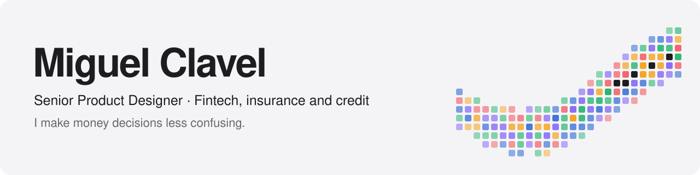
</picture>

**Senior Product Designer at U.S. News & World Report.** I work in fintech, on insurance quotes, credit cards and loans, where getting it wrong costs someone real money or real time. Ten years in design, the last four here. I make complicated products easier to use.

**[Portfolio](https://miguelclavel.com/?utm_source=github&utm_medium=profile)** · **[Ask my portfolio](https://chat.miguelclavel.com/?utm_source=github&utm_medium=profile)** · [LinkedIn](https://www.linkedin.com/in/miguelclavel/) · [Behance](https://www.behance.net/miguelclavel) · [Resume (PDF)](https://miguelclavel.com/assets/Miguel-Clavel-Senior-Product-Designer-Resume-2026.pdf) · [hello@miguelclavel.com](mailto:hello@miguelclavel.com)

## Selected work

<table>
  <tr>
    <td width="50%" valign="top">
      <a href="https://miguelclavel.com/work/auto-insurance-conversational-flow?utm_source=github&utm_medium=profile">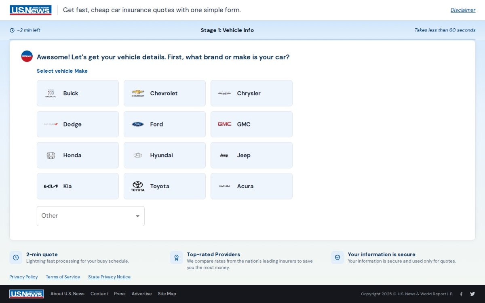</a>
      <h3><a href="https://miguelclavel.com/work/auto-insurance-conversational-flow?utm_source=github&utm_medium=profile">Conversational Insurance Flow</a></h3>
      
A car insurance quote rebuilt as a conversation, one clear question at a time. 23 form fields became 19 questions across 5 stages, answered by tapping instead of typing. No language model at runtime.

      U.S. News · Conversation design · Accessibility
    </td>
    <td width="50%" valign="top">
      <a href="https://miguelclavel.com/work/insurance-landing-page?utm_source=github&utm_medium=profile">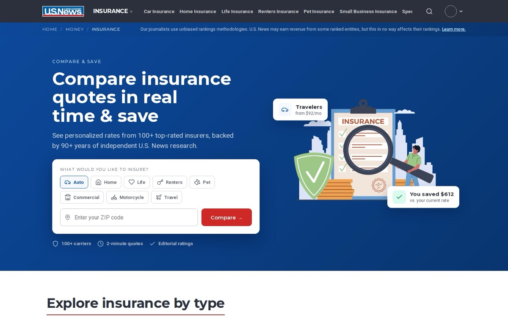</a>
      <h3><a href="https://miguelclavel.com/work/insurance-landing-page?utm_source=github&utm_medium=profile">Insurance Landing Page</a></h3>
      
A 9,500 pixel list of links with no way to start a quote. Heatmaps showed 26.6% of mobile clicks landing on things that weren't links. The rebuild put a quote form first and moved the site audit score from 66 to 88, keeping about 120 production links intact.

      U.S. News · Information architecture · Conversion
    </td>
  </tr>
  <tr>
    <td width="50%" valign="top">
      
      <h3><a href="https://miguelclavel.com/work/360-homepage-redesign?utm_source=github&utm_medium=profile">360 Homepage Redesign</a></h3>
      
Heatmap evidence and product strategy that turned a content directory into product discovery.

      U.S. News 360 Reviews · Product strategy · Research
    </td>
    <td width="50%" valign="top">
      <a href="https://miguelclavel.com/work/comparison-system?utm_source=github&utm_medium=profile">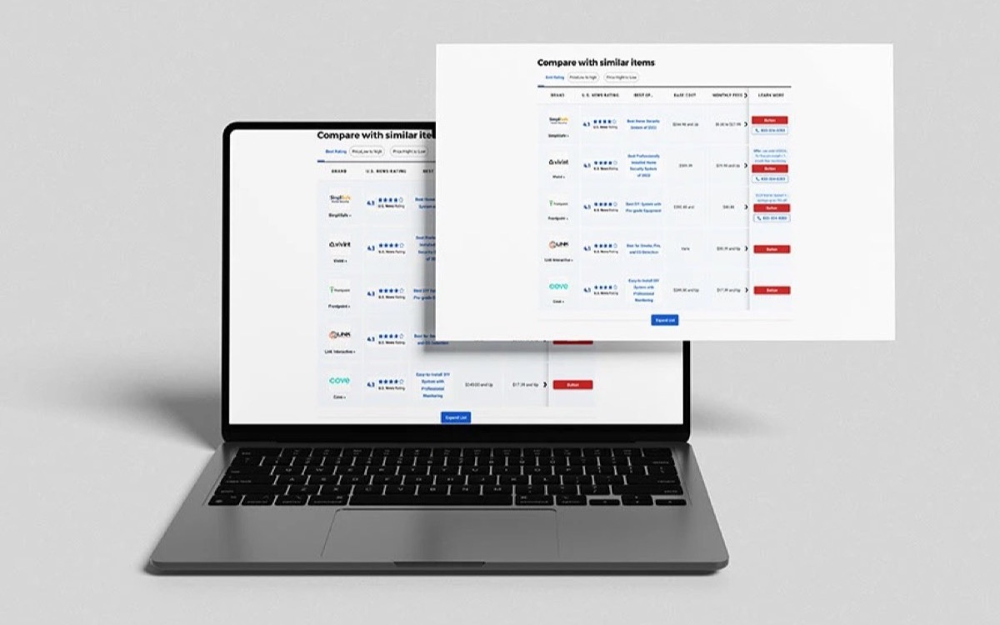</a>
      <h3><a href="https://miguelclavel.com/work/comparison-system?utm_source=github&utm_medium=profile">Comparison System</a></h3>
      
One responsive comparison pattern, from a wide desktop table down to a phone, with accessible semantics and an engineering handoff.

      U.S. News · Design systems · Decision support
    </td>
  </tr>
  <tr>
    <td width="50%" valign="top">
      <a href="https://miguelclavel.com/work/us-news-brand-guide?utm_source=github&utm_medium=profile">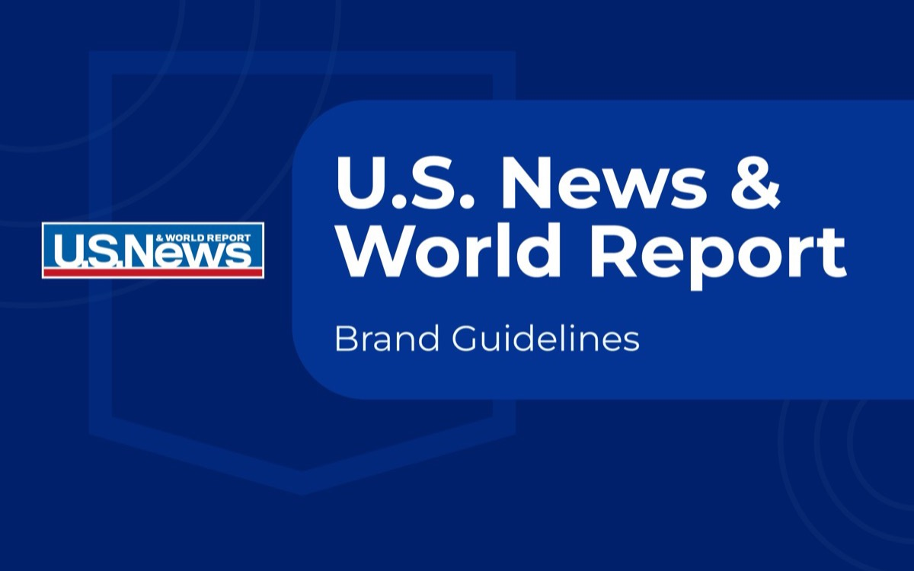</a>
      <h3><a href="https://miguelclavel.com/work/us-news-brand-guide?utm_source=github&utm_medium=profile">U.S. News Brand Guide</a></h3>
      
A brand nobody owned. I wrote the 54 page guide, took it through senior stakeholders and legal, then turned it into a system teams could actually follow.

      U.S. News · Brand and design system · Governance
    </td>
    <td width="50%" valign="top">
      <a href="https://miguelclavel.com/work/miami-heat-homepage?utm_source=github&utm_medium=profile">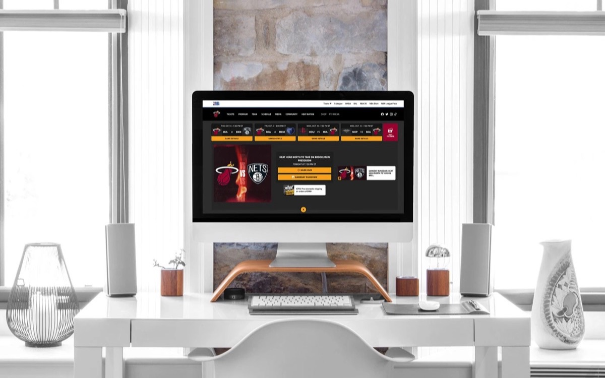</a>
      <h3><a href="https://miguelclavel.com/work/miami-heat-homepage?utm_source=github&utm_medium=profile">Miami HEAT Homepage</a></h3>
      
The digital relaunch of HEAT.com, balancing editorial and commerce across gameday states.

      Miami HEAT · Content architecture · Live operations
    </td>
  </tr>
</table>

<b>Six more case studies</b>

 
<table>
  <tr>
    <td width="33%" valign="top"><a href="https://miguelclavel.com/work/mindset-landing-page-strategy?utm_source=github&utm_medium=profile">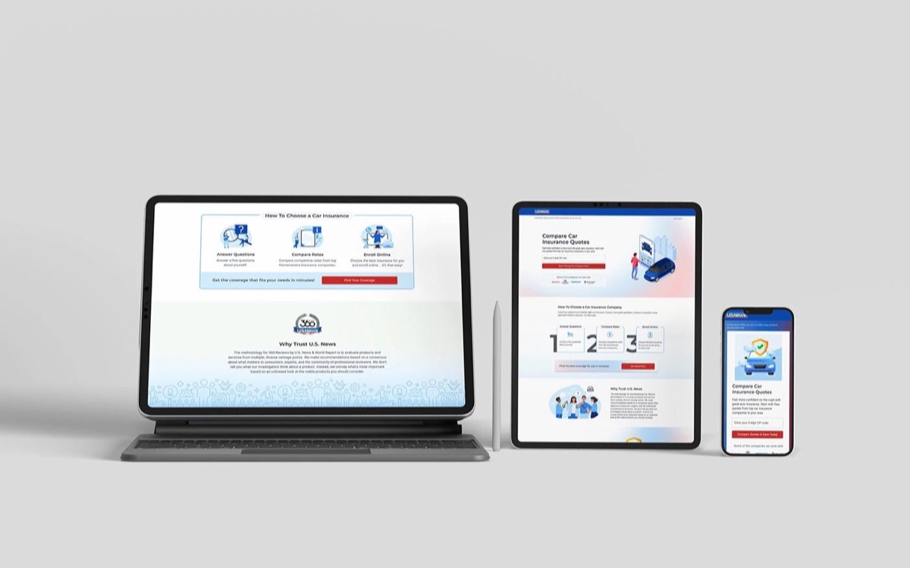 <b>Mindset Landing Page Strategy</b></a> Three testable landing page directions and a structured experiment plan.</td>
    <td width="33%" valign="top"><a href="https://miguelclavel.com/work/monthly-testing-review?utm_source=github&utm_medium=profile">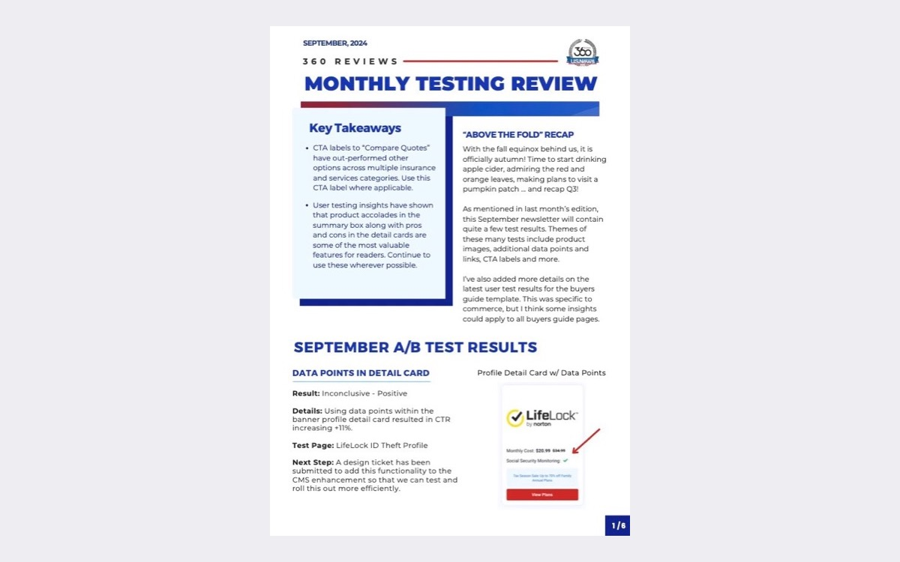 <b>Monthly Testing Review</b></a> Experiment operations that turned isolated A/B tests into shared learning.</td>
    <td width="33%" valign="top"><a href="https://miguelclavel.com/work/arena-rebrand-cms?utm_source=github&utm_medium=profile">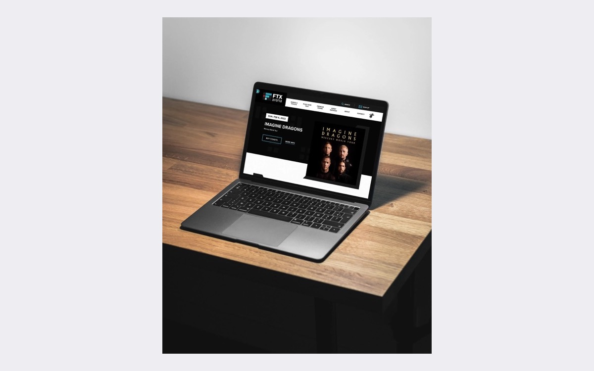 <b>Arena Rebrand and CMS Migration</b></a> A live arena site kept accurate through a full rebrand and CMS migration.</td>
  </tr>
  <tr>
    <td width="33%" valign="top"><a href="https://miguelclavel.com/work/blu-products-launch-system?utm_source=github&utm_medium=profile">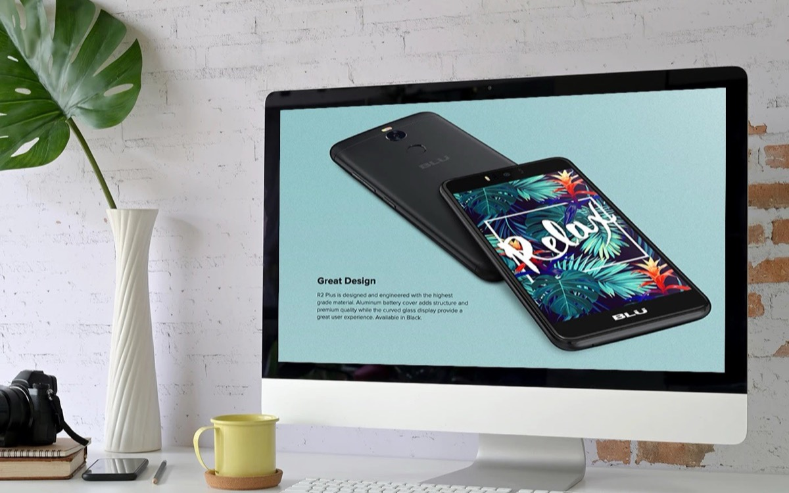 <b>BLU Products Launch System</b></a> More than 20 phone launches, every channel running off one set of parts.</td>
    <td width="33%" valign="top"><a href="https://miguelclavel.com/work/601-miami-website?utm_source=github&utm_medium=profile">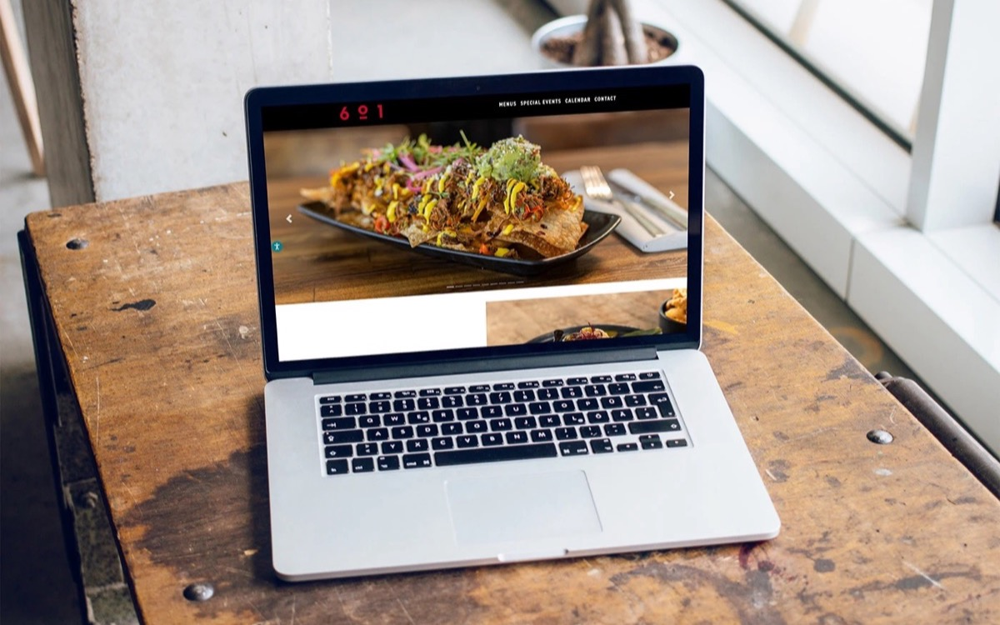 <b>601 Miami Website</b></a> Hospitality UX for a restaurant and private events venue.</td>
    <td width="33%" valign="top"><a href="https://miguelclavel.com/work/medical-training-membership-journey?utm_source=github&utm_medium=profile">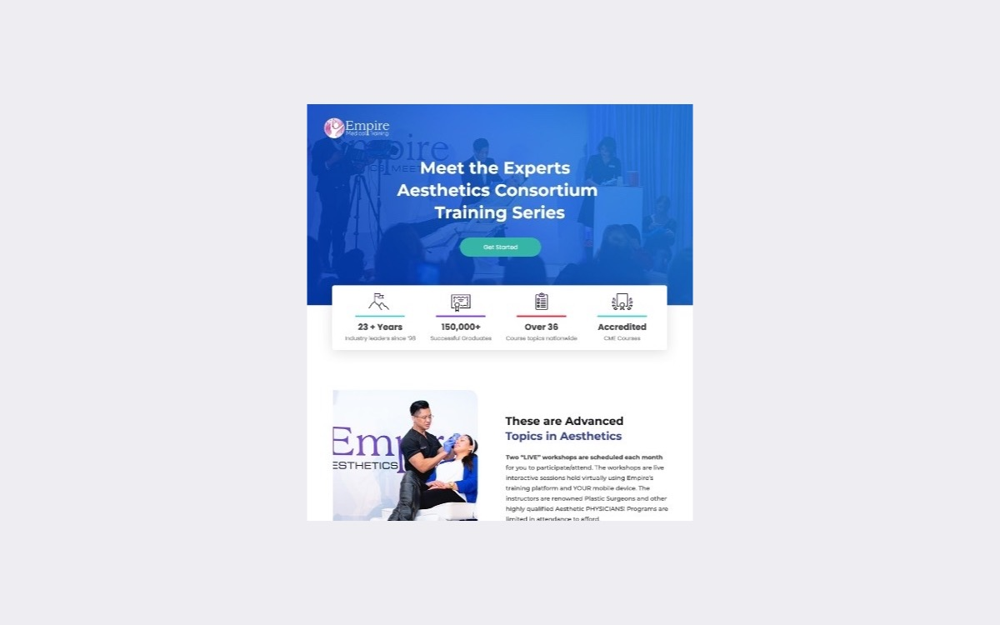 <b>Medical Training Membership Journey</b></a> A training catalog turned into a clear membership decision.</td>
  </tr>
</table>

## Things you can copy

<table>
  <tr>
    <td width="50%" valign="top">
      
      <h3><a href="https://github.com/miguelclavel/interaction-recipes">Interaction recipes</a></h3>
      
Ten small interactions from my site, each with a recording, what went wrong, and the exact prompt to build your own. Three have <a href="https://miguelclavel.github.io/interaction-recipes/">live demos</a> with single file code.

    </td>
    <td width="50%" valign="top">
      
      <h3><a href="https://github.com/miguelclavel/pixel-run-game">Pixel Run</a></h3>
      
The game in my footer. The blocks you jump spell my name. One file, React 18, no build step, and you can swap in your own face. <a href="https://miguelclavel.github.io/pixel-run-game/">Play it</a>.

    </td>
  </tr>
</table>

## Things I built with Claude Code

**[A portfolio you can talk to](https://chat.miguelclavel.com/?utm_source=github&utm_medium=profile).** AI is changing the way people look for things: we ask a question and expect an answer right away. So instead of scrolling through projects, visitors ask about my background, projects and experience, and every answer comes from my own resume and case studies, so it never makes things up about me.

- Paste a job description and it finds the most relevant work for that role
- A quick answer or a detailed one, light or dark, typed or spoken
- A weekly feedback loop: questions it can't answer yet get recorded, and I add the answers

Designed in Claude Design, built with Claude Code, running on Cloudflare Workers.

**[miguelclavel.com](https://miguelclavel.com/?utm_source=github&utm_medium=profile)**, rebuilt from the ground up working side by side with Claude. Three things broke on launch week that had nothing to do with the design, and any one of them would have meant nobody saw it. [What broke and what I learned](https://github.com/miguelclavel/miguelclavel/wiki/Built-with-Claude-Code).

## How I work

Before I open Figma, I ask:

1. What behavior are we trying to change?
2. What evidence tells us this is the real problem?
3. What happens if we do nothing?

On AI, since everyone asks. I use it daily and hands on, for research synthesis, exploring directions, and building working prototypes rather than pictures of them. It cut my synthesis time by about 40%. It hasn't replaced the judgment part. I'm a product designer who understands AI, not an AI person who makes websites.

## Experience

| When | Where | Role |
| --- | --- | --- |
| 2022&nbsp;to&nbsp;now | U.S. News & World Report | Senior Product Designer, FinTech (credit cards, insurance and loans), and before that Enterprise Systems and 360 Reviews |
| 2021&nbsp;to&nbsp;2022 | Miami HEAT | Digital Experience Designer |
| 2019&nbsp;to&nbsp;2021 | Empire Medical Training | Senior Graphic Designer, Digital Experience and Brand Strategy |
| 2014&nbsp;to&nbsp;2019 | BLU Products | Graphic Designer, Product, Retail and Digital Experience |

Florida Atlantic University, BFA in Graphic Design.

**What I work with:** product strategy, information architecture, journey mapping, user research, usability testing, experimentation and A/B testing, design systems, responsive design, accessibility and WCAG, conversational and agentic UX, AI product design. Figma and FigJam, Figma Make, Claude and Claude Code, v0, analytics and heatmaps.

---

More in the <a href="https://github.com/miguelclavel/miguelclavel/wiki">wiki</a>: every case study, how I work with AI, and the interaction prompts. Work is shown for portfolio purposes and was produced during my employment with the companies named. Confidential material has been omitted or altered.
